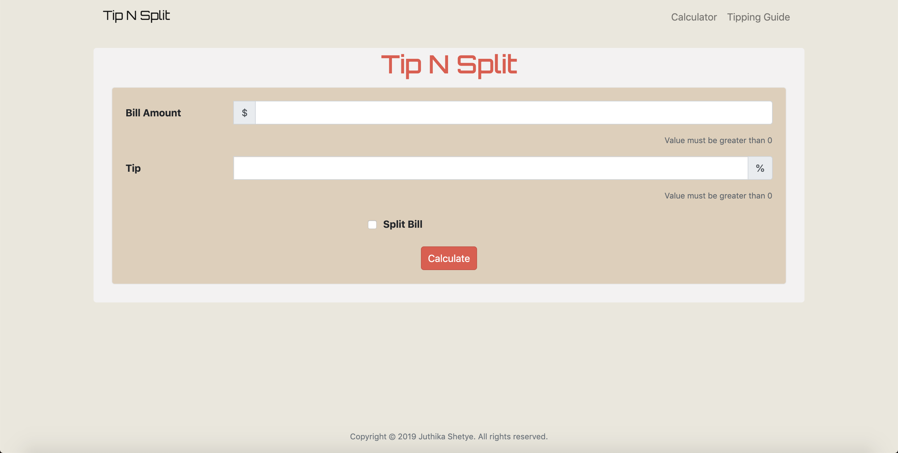

# Tip N Split

Link to the deployed app: [Tip N Split](https://juthikashetye.github.io/Tip-N-Split/)

## About the app

* Tip N Split is a useful app for anyone who goes out to a restaurant, bar, or any place where you are supposed to tip.
* Quickly calculate the tip amount for your bill. Includes a feature to split the cost between any number of people so you know exactly how much you and your friends should tip, every time.
* And if you ever have a problem figuring out how much to tip, then this app also gives you some helpful 'tips' on tips.

## Tools and Technologies used

* This is a front-end web app created using the following:

	* HTML5
	* CSS3
	* Bootstrap 4
	* JavaScript
	* jQuery

## Running the app

* For running the app on your computer, first clone or download the repository.
* Go into the root folder and right click on `index.html` and  select `Open in browser`
* The app should be now running on your browser.